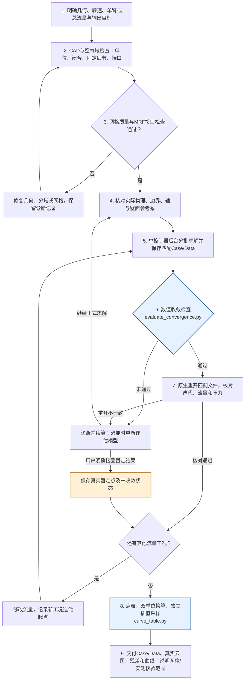

# 工作流程

这是技能指导的工程流程，**不是所有节点都有现成自动执行程序**。蓝色节点对应包内分析脚本，CAD/Fluent步骤由Agent结合用户本地工具与适配脚本完成。

```mermaid
flowchart TD
    A["1. 明确几何、转速、单臂或总流量与输出目标"] --> B["2. CAD与空气域检查：单位、闭合、固定细节、端口"]
    B --> C{"3. 网格质量与MRF接口检查通过？"}
    C -- 否 --> R["修复几何、分域或网格，保留诊断记录"]
    R --> B
    C -- 是 --> E["4. 核对实际物理、边界、轴与壁面参考系"]
    E --> F["5. 单控制器后台分批求解并保存匹配Case/Data"]
    F --> G{"6. 数值收敛检查<br/>evaluate_convergence.py"}
    G -- 未通过 --> D["诊断并续算；必要时重新评估模型"]
    D -- 继续正式求解 --> E
    D -- 用户明确接受暂定结果 --> P["保存真实暂定点及未收敛状态"]
    G -- 通过 --> H["7. 原生重开匹配文件，核对迭代、流量和压力"]
    H -- 重开不一致 --> D
    H -- 核对通过 --> N{"还有其他流量工况？"}
    P --> N
    N -- 是 --> M["修改流量，记录新工况迭代起点"]
    M --> F
    N -- 否 --> Q["8. 点表、双单位换算、独立插值采样<br/>curve_table.py"]
    Q --> W["9. 交付Case/Data、真实云图、残差和曲线，说明网格/实测核验范围"]
    classDef helper fill:#e6f2ff,stroke:#2367a1,stroke-width:2px
    classDef provisional fill:#fff0d6,stroke:#a96812,stroke-width:2px
    class G,Q helper
    class P provisional
```

未收敛结果只能按用户要求作暂定交付；数值收敛也不自动代表几何、网格和实验已验证。
